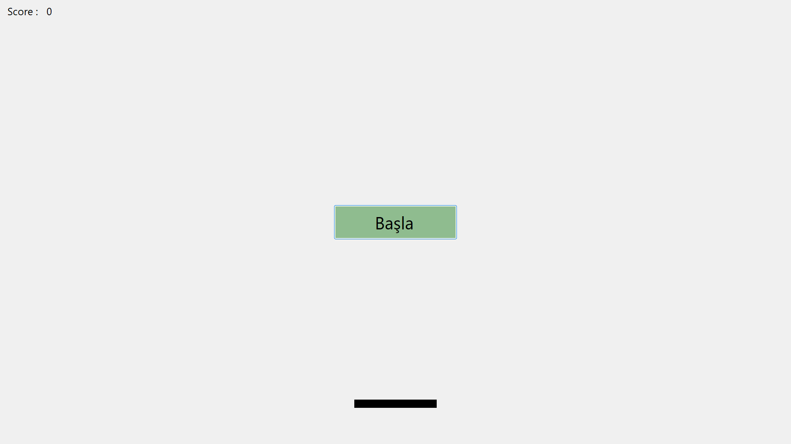
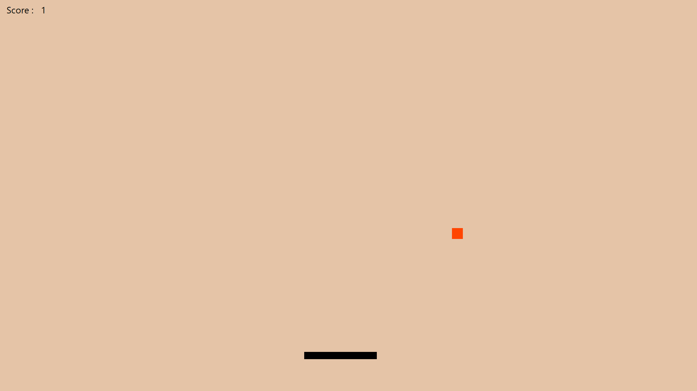
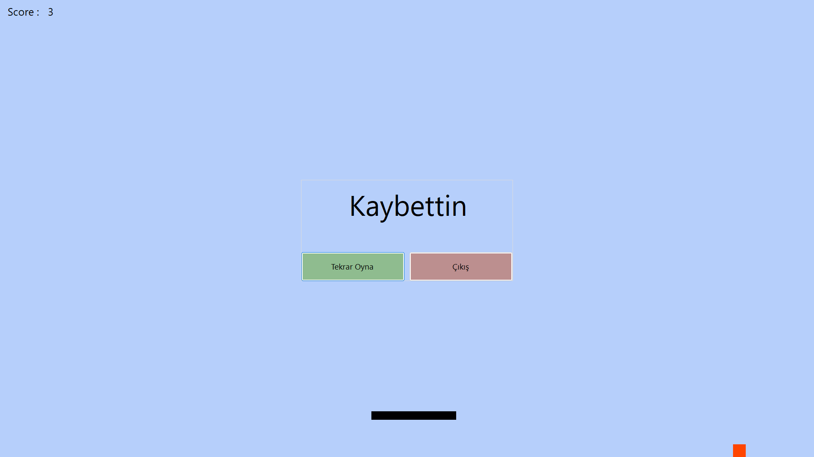

# Windows Forms PinPon Oyunu

## 🎮 Oyun Hakkında
Bu proje, C# dili kullanılarak Windows Forms platformunda geliştirilmiş basit bir **PinPon (Pong)** oyunudur.  
Oyunda bir top ve bir raket bulunur. raketi sağa/sola **fare** ile hareket ettirerek topun aşağı gitmesini engellemeye çalışırsınız.

---

## 🛠️ Özellikler
- Windows Forms arayüzü ile görsel oyun ortamı
- Basit skor sistemi
- Topun çarpışmalarına bağlı yön değiştirme mekaniği

---

## 📷 Oyun İçi Görüntüler


### Ana Ekran
  

### Oyun Anı
  

### Skor Görünümü
  

---

## ⌨️ Kontroller
- **Mouse** : Raketin hareketi için kullanılır.

---

## 🚀 Projeyi Çalıştırma
Projeyi kendi bilgisayarınızda çalıştırmak için:
1. Bu repository'yi klonlayın:
   ```bash
   git clone https://github.com/k0laa/Windows_Forms_PinPon_Oyunu.git
   ```
2. Visual Studio veya uyumlu bir C# IDE'si ile çalıştırabilrisiniz.
3. Proje dosyasını açın ve `Windows_Forms_PinPon_Oyunu\bin\Debug\net8.0-windows\Windows_Forms_PinPon_Oyunu.exe` dosyasını çalıştırın.

---

## 📂 Proje Yapısı
```
Windows_Forms_PinPon_Oyunu/
├── resources/
│   ├── game_over.png
│   ├── in_game.png
│   └── start_page.png
├── Windows_Forms_PinPon_Oyunu.sln
├── Windows_Forms_PinPon_Oyunu/
│   ├── bin/
│   │   └── Debug/
│   │       └── net8.0-windows/
│   │          └── Windows_Forms_PinPon_Oyunu.exe
│   ├── Form1.Designer.cs
│   ├── Form1.cs
│   └── Program.cs
└── README.md
```
